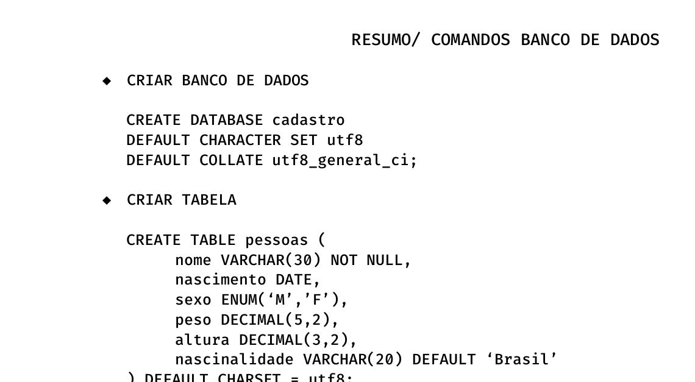

** BANCOS DE DADOS 4° PERIODO CIÊNCIAS DA COMPUTAÇÃO

*** Boas praticas de codigo para melhor peformace 

- ADICIONAR UMA NOVA COLUNA
`
  ALTER TABLE pessoas
  ADD COLUMN profissao VARCHAR(10);
`

- APAGAR COLUNA
`
  ALTER TABLE pessoas
  DROP COLUMN profissao;
`
